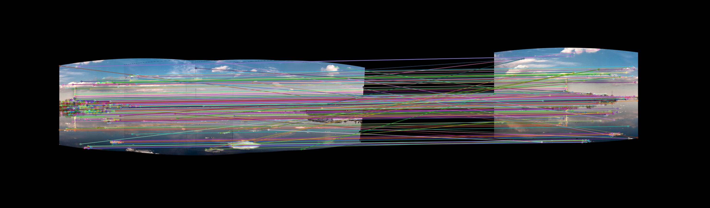

# Manual Image Stitching for Panoramas

This repository contains a *manual* implementation of image stitching in Python with the aim to reproduce similar results to OpenCV's built-in *automatic* `cv2.Stitcher`.

**Contents:**

- [Results Showcase](#results-showcase)
- [Quick Start](#quick-start)
- [Stitching Methods](#stitching-methods)
- [Step-by-Step Process](#step-by-step-process)
- [Usage](#usage)
- [Output](#output)
- [Repository Structure](#repository-structure)
- [Dependencies](#dependencies)

## Results Showcase

### Dataset
| Image 1 | Image 2 | Image 3 | Image 4 | Image 5 | Image 6 |
|---------|---------|---------|---------|---------|---------|
|  |  |  |  |  |  |

### Final Panoramas

**Perspective Stitching (3 Images):**


**Spherical Stitching (6 Images):**


**Automatic Stitching (6 Images):**


## Quick Start

```bash
# Automatic stitching (OpenCV built-in)
./run_automatic_boat6.sh

# Manual stitching - from-scratch implementation
./run_perspective_boat3.sh
./run_spherical_boat6.sh
```

## Repository Structure

```
Image Stitching/
├── images/
│   ├── boat3/          # 3-image boat dataset
│   └── boat6/          # 6-image boat dataset
├── src/
│   └── python/
│       ├── automatic/
│       │   ├── auto_stitcher.py
│       │   └── output/
│       └── manual/
│           ├── manual_stitcher.py
│           ├── output/
│           └── steps/
├── run_automatic_boat6.sh
├── run_perspective_boat3.sh
└── run_spherical_boat6.sh
```

## Stitching Methods

### Automatic Stitching
Uses OpenCV's built-in `cv2.Stitcher` - a black-box solution that automatically:
- Detects features and matches them
- Estimates homography transformations  
- Warps and blends images

### Manual Stitching (From-Scratch)
A complete from-scratch implementation that gives you full control over each step:
1. **Feature Detection**: SIFT keypoint detection
2. **Feature Matching**: FLANN matching with Lowe's ratio test
3. **Homography Estimation**: RANSAC-based homography calculation
4. **Image Warping**: Perspective transformation
5. **Blending**: Smooth transition between overlapping regions

**Why "Manual"?** This implementation builds the stitching pipeline from the ground up, allowing you to understand and modify each step of the process.

#### Projection Types

- **Perspective**: Standard flat panoramas
- **Spherical**: 360° panoramas with automatic focal length detection

## Step-by-Step Process

### Perspective Stitching Process (3 Images)

**1. Feature Detection:**
| Image 1 | Image 2 | Image 3 |
|---------|---------|---------|
|  |  |  |

**2. Feature Matching:**
| Image 1 & 2 | Image 2 & 3 |
|-------------|-------------|
|  |  |

**3. Warped Images (with center image as reference):**
| Image 1 | Image 2 | Image 3 |
|---------|---------|---------|
|  |  |  |

**4. Blending:**


### Spherical Stitching Process (6 Images)

**1. Spherical Projection & Feature Detection:**
| Image 1 | Image 2 | Image 3 |
|---------|---------|---------|
|  |  |  |

| Image 4 | Image 5 | Image 6 |
|---------|---------|---------|
|  |  |  |

**2. Progressive Feature Matching & Blending:**

The algorithm follows this strategy:
```text
1. Compute all keypoints & create lookup table
2. Start with reference image
3. While images left:
   - Match keypoints of current (combined) image with remaining image that has the most common keypoints
   - Warp & blend images together
```

| Images | Feature Matches |
|-------------|----------------|
| 4 vs. 5 |  |
| vs. 6 |  |
| vs. 3 |  |
| vs. 2 |  |
| vs. 1 |  |

**Output:**


## Usage

### Shell Scripts (Recommended)
```bash
# Automatic (OpenCV built-in)
./run_automatic_boat6.sh

# Manual from-scratch implementations
./run_perspective_boat3.sh
./run_spherical_boat6.sh
```

### Direct Python Execution
```bash
# Automatic
cd src/python/automatic && python auto_stitcher.py

# Manual from-scratch
cd src/python/manual && python manual_stitcher.py --dataset boat3 --projection perspective
cd src/python/manual && python manual_stitcher.py --dataset boat6 --projection spherical
```

### Command Line Arguments

#### Manual Stitcher (`manual_stitcher.py`)
- `--dataset`: Dataset name (e.g., `boat3`, `boat6`)
- `--projection`: Projection type (`perspective` or `spherical`)
- `--focal_length`: Focal length for spherical projection in mm (default: 25.0)
- `--reference_index`: Index of reference image (defaults to middle image)
- `--no-visualize`: Disable step-by-step visualization (enabled by default)

## Output

- **Automatic**: `src/python/automatic/output/boat6/panorama.jpg`
- **Manual**: `src/python/manual/output/<dataset>/`
- **Step-by-step visualization**: `src/python/manual/steps/<dataset>/`

## Repository Structure

```
Image Stitching/
├── images/
│   ├── boat3/          # 3-image boat dataset
│   └── boat6/          # 6-image boat dataset
├── src/
│   └── python/
│       ├── automatic/
│       │   ├── auto_stitcher.py
│       │   └── output/
│       └── manual/
│           ├── manual_stitcher.py
│           ├── output/
│           └── steps/
├── run_automatic_boat6.sh
├── run_perspective_boat3.sh
└── run_spherical_boat6.sh
```

## Dependencies

- OpenCV (cv2)
- NumPy
- Pathlib
